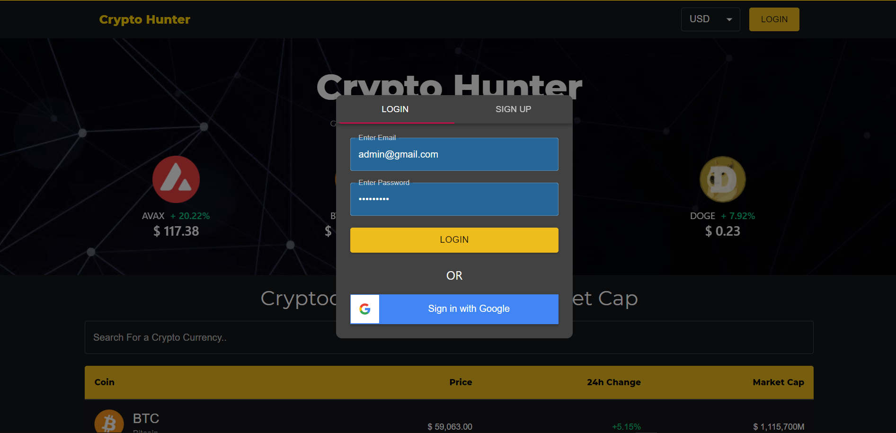
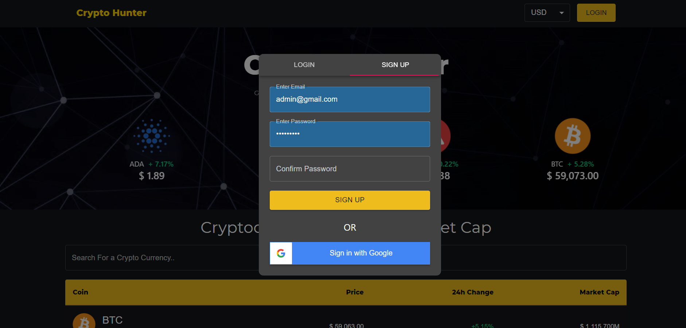
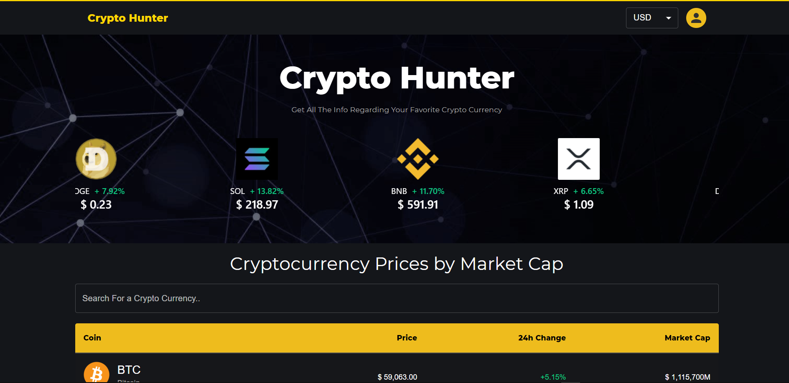
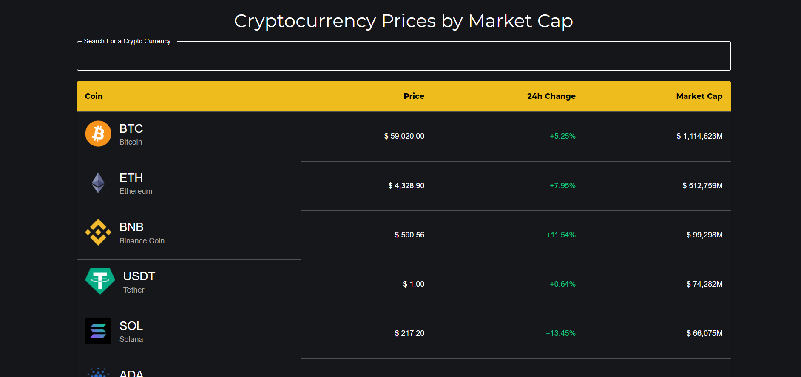
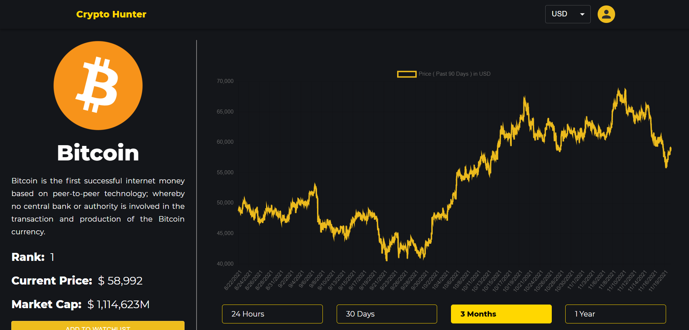
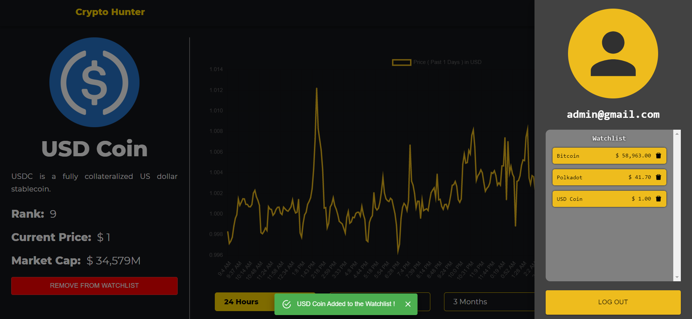
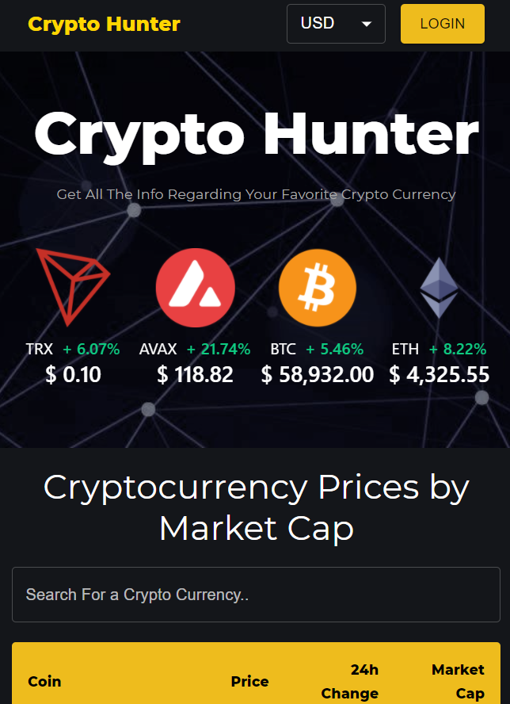
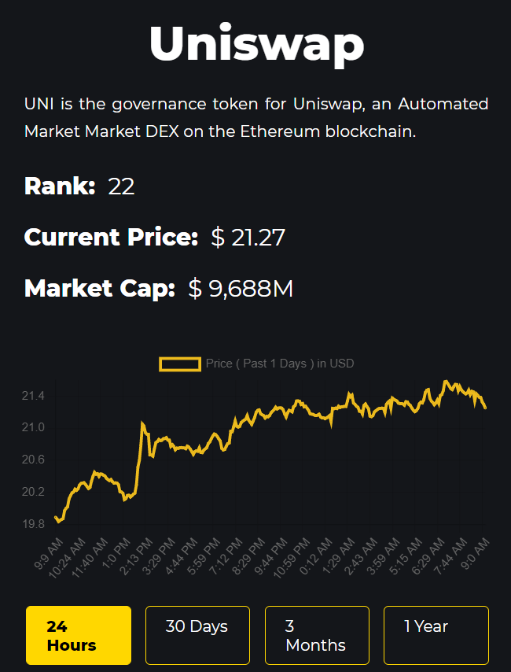

## Crypto-Hunter

[Crypto-Hunter]() application helps us to track trending crypto-currency coins, provides last 24hr market capitalization including add to wishlist feature, using firebase authentication of login and sign-up.

## Features

- Firebase Authentication (Google & Email Sign-up/Login)
- Add to Wishlist
- Search For Crypto-Currency
- Carousel for Trending Coins
- Mobile Responsive
- Charts for Particular Coins (Historical Data)
- Available in INR & USD
- Table Contains : Coin | Price | 24h Change | Market Cap

## Built With

- [React JS](https://reactjs.org/)
- [Material UI](https://v4.mui.com/)
- [Chart JS](https://reactchartjs.github.io/react-chartjs-2/#/)
- [Firebase](https://firebase.google.com/)

## Live Demo

Here is a working live demo :

## Site Overview

### Login

### Sign-Up

### Homepage

### Crypto Coins Table

### Individual Coin

### Wishlist/Logout

### Mobile Responsive

## Issues

Feel free to submit [issues](https://github.com/chaitanyatekane/CryptoCurrency-Tracker/issues) and enhancement requests.

## Contribute

1.  **Fork** this repo on GitHub
2.  **Clone** this project to your own machine
3.  **Commit** changes to your own branch
4.  **Push** your work back up to your fork
5.  Submit a **Pull request** so that I can review your changes

NOTE: Make sure to merge the latest from "upstream" before making a pull request!

## Connect With Me

<!--  -->

<!-- ### Installed Packages, Etc

- [Material-UI (version-4)](https://v4.mui.com/)  
  Command -> npm install @material-ui/core @material-ui/lab
- React-Router  
  Command -> npm i react-router-dom
- [CoinGecko API](https://www.coingecko.com/en/api/documentation)
- Axios For Fetching API 
  Command -> npm i axios
- [React Alice Carousel](https://www.npmjs.com/package/react-alice-carousel) 
  Command -> npm i react-alice-carousel 
  Also Import in index.js-> import 'react-alice-carousel/lib/alice-carousel.css';
- React HTML Parser  
  Command -> npm i react-html-parser
- [React-ChartJs](https://www.npmjs.com/package/react-chartjs-2) 
  Command -> npm install --save react-chartjs-2 chart.js
- Installed Firebase 
  Command -> npm install firebase 
- React Google Button  
  Command -> npm install react-google-button 
- React Icons  
  Command -> npm i react-icons 

### Font Used

- Montserrat (Google Fonts)  
  (Light 300, Regular 400, Extra-bold 800)

### Topics To Learn

- React Router
- Material-UI
- Context-API (State Management) -->
